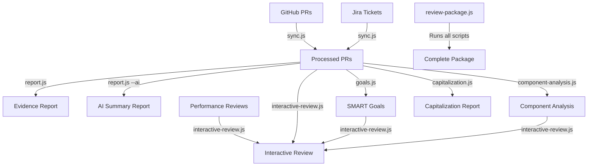
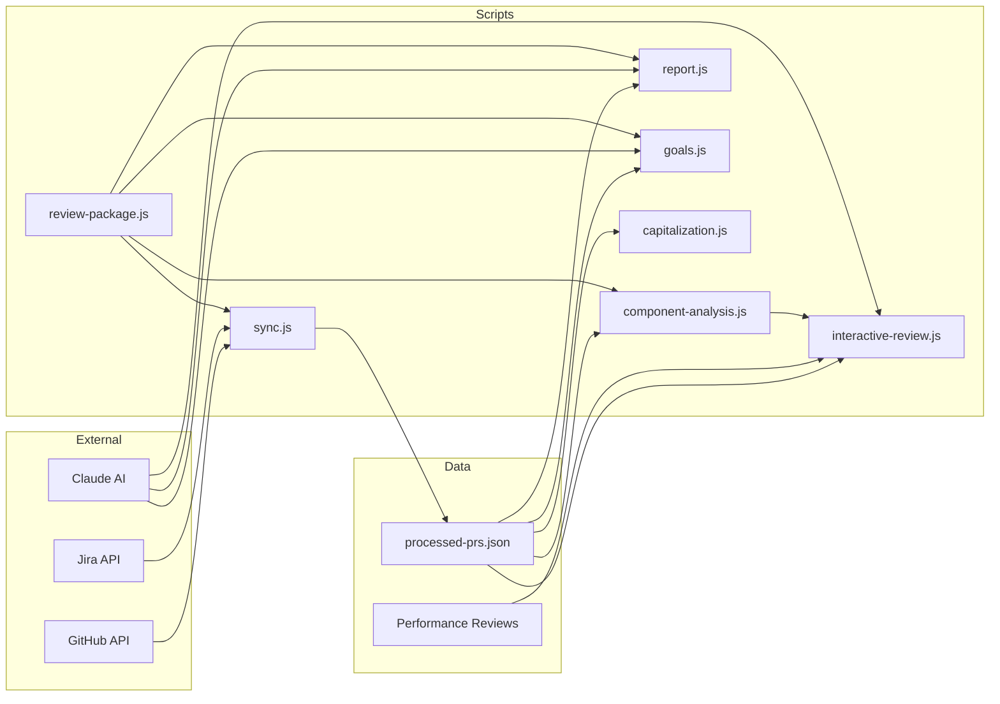
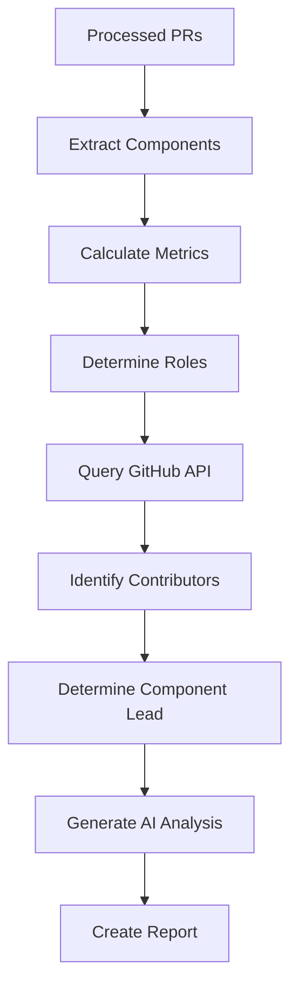
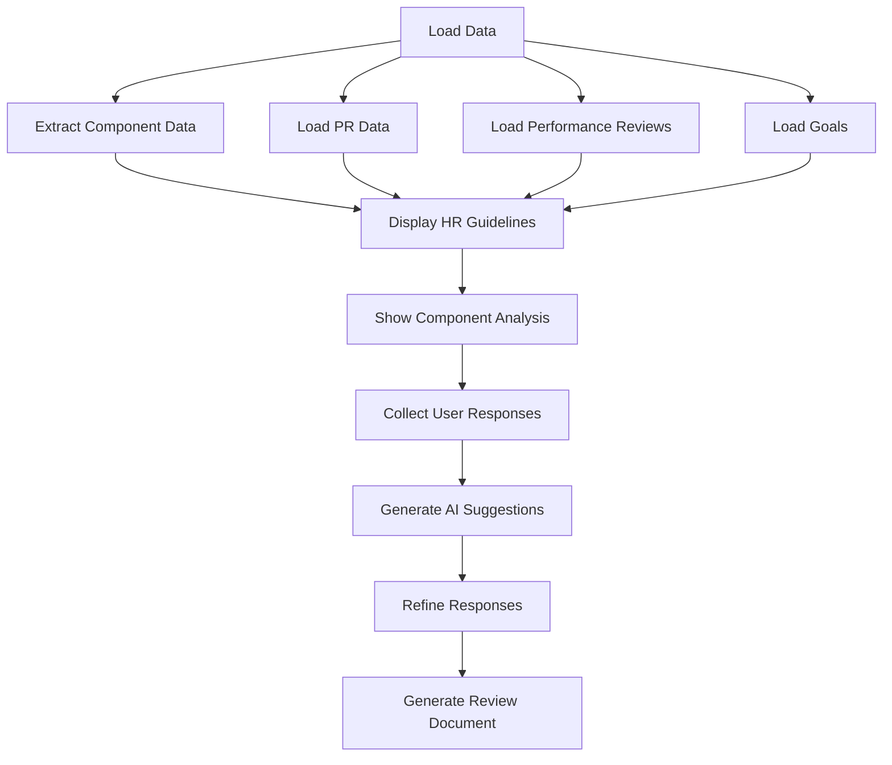

# DevTrail

Track your development journey through GitHub PRs and performance reviews. DevTrail is a powerful Node.js CLI tool that analyzes your GitHub pull requests and performance review documents to generate evidence for performance reviews, track capitalizable work, and set SMART career goals.

## Setup

1. Clone this repository
2. Run `npm install` to install dependencies
3. Create a `config.json` file (see `config.example.json` for format)

## Required API Keys

### GitHub Token

Create a GitHub personal access token with the required permissions:

[Create Token with Required Permissions](https://github.com/settings/tokens/new?scopes=repo,read:org,read:user,user:email&description=GH-Feedback%20CLI)

This link pre-selects:

- `repo` (full control of private repos)
- `read:org` (read org membership)
- `read:user` (read user profile data)
- `user:email` (access email addresses)

### Jira API Token

If using Jira integration:

1. Generate an API token from [Atlassian Account Settings](https://id.atlassian.com/manage-profile/security/api-tokens)
2. Add your Jira host, email, and token to `config.json`

### Anthropic API Key

For Claude integration:

1. Get an API key from [Anthropic Console](https://console.anthropic.com/)
2. Add your key to `config.json`

## Configuration

Create a `config.json` file with:

```json
{
  "github_token": "YOUR_GITHUB_TOKEN",
  "repos": ["owner/repo1", "owner/repo2"],
  "jira_host": "your-domain.atlassian.net",
  "jira_email": "your-email@example.com",
  "jira_api_token": "YOUR_JIRA_API_TOKEN",
  "jira_projects": ["ONE", "TWO"],
  "anthropic_api_key": "YOUR_ANTHROPIC_API_KEY"
}
```

## Usage

DevTrail provides several commands for different purposes:

```bash
# Collect PR evidence from GitHub
npm run sync

# Generate detailed evidence report from PRs
npm run report

# Generate enhanced report using both PRs and performance reviews
npm run report-enhanced

# Generate concise AI summary report
npm run summary

# Generate comprehensive performance summary
npm run comprehensive-summary

# Generate SMART career goals
npm run goals

# Track progress on goals
npm run goals-progress

# Generate software capitalization report
npm run cap

# Analyze component contributions and leadership
npm run components

# Generate complete performance review package
npm run review-package

# Run interactive review session
node scripts/interactive-review.js
```

## Workflow Diagrams

### Overall Workflow



### Data Flow



### Component Analysis



### Interactive Review



For a dry run (limited PR processing):

1. Add `"dry_run": true` to your `config.json`
2. Run `npm run sync`

## How It Works

### Main PR Analysis

1. Loads criteria from `criteria.csv`
2. Fetches closed/merged PRs from configured GitHub repos
3. For each PR you've interacted with:
   - Extracts Jira ticket info if present (including full description and comments)
   - Sends PR details to Claude AI
   - Identifies multiple matching review criteria with confidence scores
   - Saves PR data with merge dates for future analysis
4. Saves evidence to `data/processed-prs.json` with merge dates for timeline analysis

### Performance Review Integration

1. Organizes performance reviews in the `lattice` directory by year
2. Automatically finds and loads all review files (employee and manager reviews)
3. Analyzes review content to find evidence matching criteria
4. Weighs evidence based on recency (newer reviews get higher weight)
5. Combines PR evidence with review evidence for a complete performance picture

### Reports

- **Standard Report**: Comprehensive evidence from PRs grouped by criteria
- **Enhanced Report**: Combined evidence from both PRs and performance reviews
- **AI Summary**: Concise bullet points summarizing your achievements
- **Comprehensive Summary**: Narrative summary (max 7 paragraphs) highlighting key accomplishments, patterns, and growth areas
- **Goals**: SMART career goals with milestones based on your strengths, growth areas, and future Jira tickets
- **Goals Progress**: Track progress against previously set goals
- **Capitalization**: Monthly breakdown of capitalizable work with hour estimates (based on Jira completion dates)
- **Component Analysis**: Detailed breakdown of your component contributions and leadership roles

All reports are saved as timestamped markdown files in the `reports` directory.

### Directory Structure

- `/data`: Processed PR data and other generated data files
- `/lattice`: Performance review documents organized by year
  - `/lattice/YYYY`: Annual reviews (e.g., 2024)
  - `/lattice/YYYY-mid`: Mid-year reviews
  - `/lattice/example`: Example templates for different review types
- `/reports`: Generated reports with timestamps
- `/scripts`: All script files
